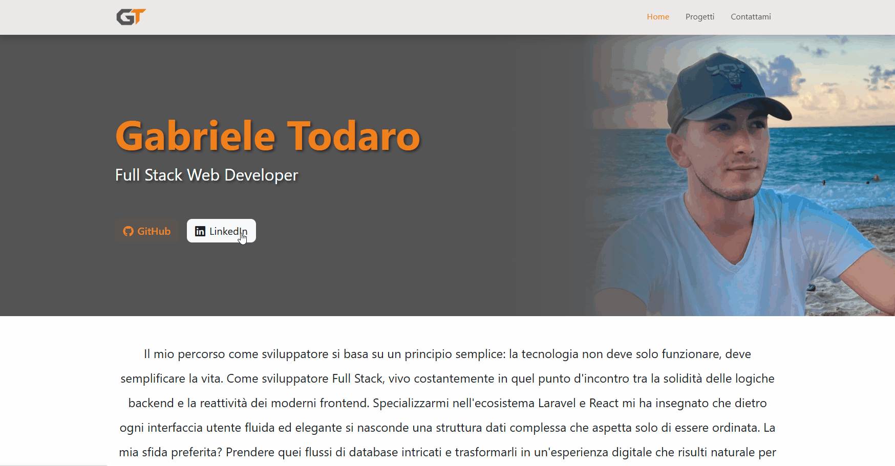

# React Portfolio Front-end

Una moderna Single Page Application (SPA) creata con **React** per esporre dinamicamente i progetti e il profilo professionale attraverso il consumo di API REST. Il progetto include un sistema di filtraggio avanzato per categorie e tecnologie, rotte dinamiche per il dettaglio dei progetti e un'area contatti funzionale.

### Demo

### Tecnologie Utilizzate

* **React**
* **React Router DOM**
* **Axios**
* **Bootstrap**
* **JavaScript**
* **CSS**
